# Projektvorschlag Dofus Ressourcenplaner

**Hochschule Worms CSA 151 WS 2018/19**

Gruppe 4

Jennifer Nguyen
inf2735@hs-worms.de
Matrikelnummer: 672286

Julian Schulzeck
inf2834@hs-worms.de
Matrikelnummer: 672912

---

## Abstract

Da wir beide das Online MMORPG "Dofus" spielen, sind wir auf die Idee gekommen einen Ressourcenplaner für das Spiel umzusetzen.
Nun was ist denn ein "Ressourcenplaner" für dieses "Dofus"?

Dazu müssen wir kurz einen Teilaspekt von Dofus näher erläutern und zwar das Herstellen von Gegenständen.
Es gibt 13 Berufe bei denen man Gegenstände herstellen kann. Jeder Beruf hat seine jeweiligen Gegenstandstypen, die er herstellt.
Welche Gegenstände man herstellen kann, hängt von dem erreichten Level in dem jeweiligen Beruf ab (Min Level: 1, Max Level: 200 bei jeweils allen Berufen) und natürlich,
ob man die benötigten Ressourcen für den Gegenstand besitzt. Die Ressourcen können ebenfalls Gegenstände sein, die man herstellen muss oder auch einfach
Ressourcen, die man von Monstern bekommt. Um einen Beruf zu Leveln, muss man Gegenstände herstellen.

Wenn man nun einen Beruf von 1 auf Level 200 Leveln möchte, muss man ziemlich viele Gegenstände herstellen und man verliert leicht den Überblick,
welche Ressourcen man jetzt schon hat und welche nicht. Gerade wenn man für die Herstellung eines Gegenstandes Gegenstände benötigt, die ebenfalls hergestellt werden müssen.

Um das ganze besser planbar und übersichtlich zu machen, wollen wir den Ressourcenplaner entwerfen. Der Benutzer kann also unserem Programm sagen, welche Gegenstände er gerne herstellen
würde, und unser Programm erstellt automatisch eine Liste von allen Ressourcen, die benötigt werden um alle Gegenstände auf der Liste herzustellen, in einer übersichtlichen Liste.
Wie dieser Clientseitig umgesetzt werden soll, wird im Abschnitt "Abstract Client" näher beschrieben.


## Abstract Client
Verantwortliche: Jennifer Nguyen

### Menüpunkt "Übersicht"

Nachdem der Benutzer sich registriert und eingeloggt hat, befindet er sich auf dem Menüpunkt "Übersicht". Dort sieht er eine Übersicht von allen herstellbaren Gegenständen
im Spiel. Diese kann er nach Level und/oder Beruf filtern, oder auch nach einem bestimmten Gegenstand suchen.
Für jeden der angezeigten Gegenständen hat er nun über Buttons die Möglichkeit, sich entweder die Rezeptur anzeigen zu lassen (also die Ressourcen die zur Herstellung des Gegenstandes
benötigt werden), oder ihn in eine Liste hinzuzufügen. Wenn der Benutzer noch keine Liste angelegt hat, oder es in einer neuen Liste speichern möchte, hat er hier gleich die
Möglichkeit eine neue Liste anzulegen.

### Menüpunkt "Meine Listen"

Hier hat der Benutzer eine Übersicht von all seinen erstellten Listen. Über einen Button hat der Benutzer die Möglichkeit die jeweiligen Listen zu löschen.
Wenn er auf eine seiner Listen klickt, wird ihm der Reiter Gegenstand (auf dem er sich direkt befindet) und der Reiter Ressourcen angezeigt.

#### Reiter "Gegenstand"

Hier wird eine Übersicht der in der Liste hinzugefügten Items angezeigt. Pro Item wird Anzahl (wie oft soll der Gegenstand hergestellt werden?), Level des Gegenstandes,
der Beruf der den entsprechenden Gegenstand herstellen kann und die Ressourcen, die für den Gegenstand benötigt werden, angezeigt.

#### Reiter "Ressourcen"

Hier hat der Benutzer eine Übersicht über alle Ressourcen, die er benötigt um die auf der Liste hinzugefügten Items herzustellen. Es ist möglich die Anzahl an bereits gesammelten
Ressourcen einzutragen und wenn die benötigte Anzahl einer Ressource erreicht wurde, wird dies kenntlich gemacht. So hat der Benutzer eine gute Übersicht was er bereits gesammelt hat
und was er noch besorgen muss. Gegenstände, die eine eigene Rezeptur benötigen, werden ebenfalls gekennzeichnet und über einen Klick werden die dafür benötigten
Gegenstände mit auf die Liste geschrieben.

## Wireframe


## Mobil

### Login
Der Benutzer muss sich mit seinem Benutzernamen und Passwort anmelden um auf die Übersichtsseite zu kommen.
Ist er noch nicht registriert, kann er durch den Button "Anmelden unmöglich" zur Registrierung gelangen.

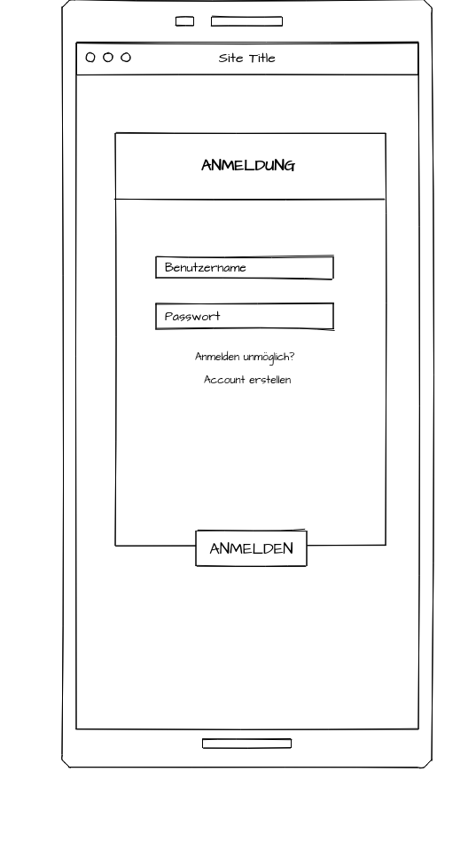

### Registrierung
Der Benutzer kann einen neuen Account unter Angabe von Benutzername, E-Mail und Passwort erstellen.
Besitzt der Benutzer bereits einen Account, kann er über den Button "Bereits einen Account?" zum Login gelangen.

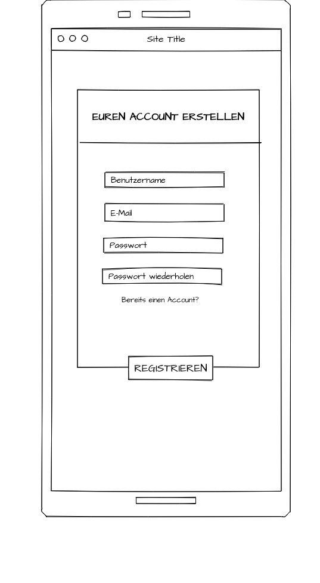

### Übersicht

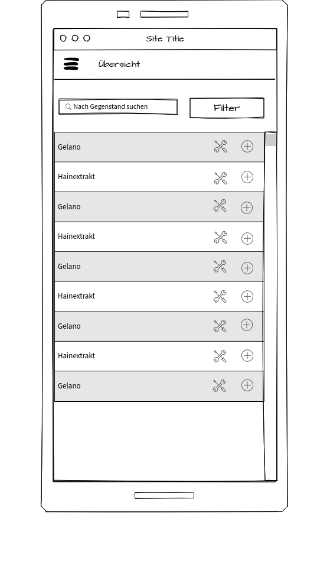

### Übersicht Filter
Das ist der Filter wenn man bei Übersicht auf "Filter" klickt

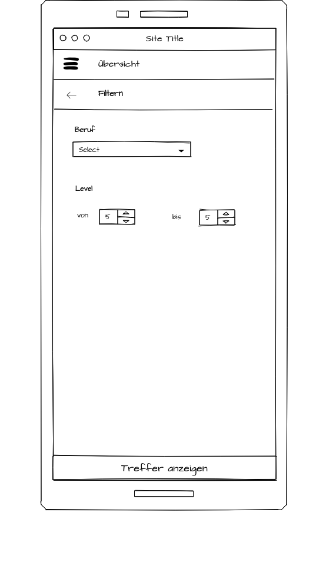

### Meine Listen

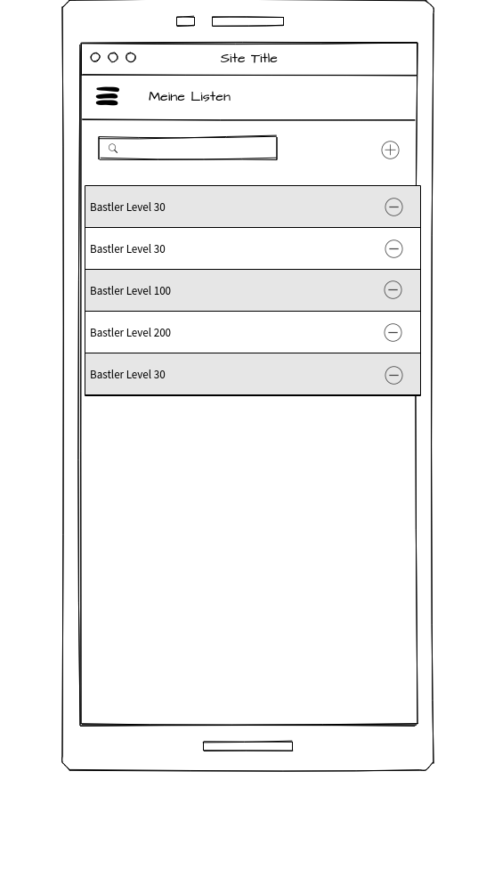

### Meine Liste - Reiter Gegenstand

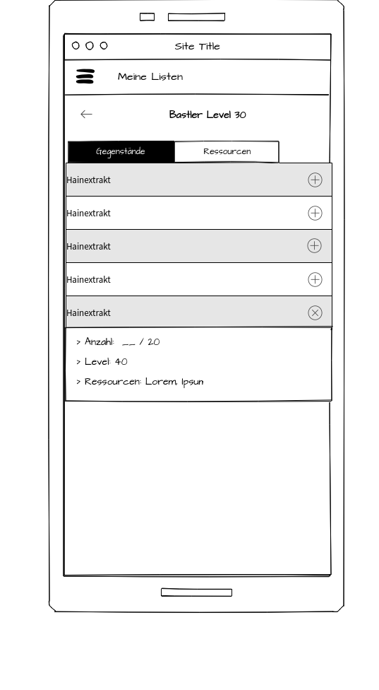

### Meine Listen - Reiter Ressourcen

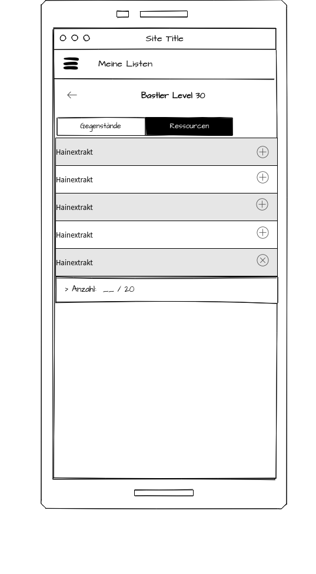

## Desktop

### Anmeldung

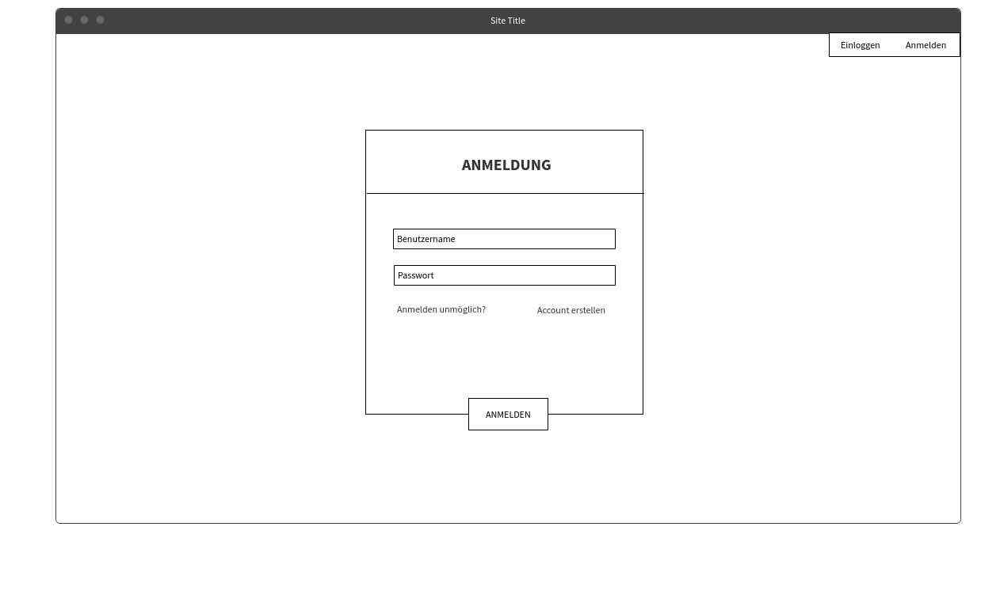

### Registrierung

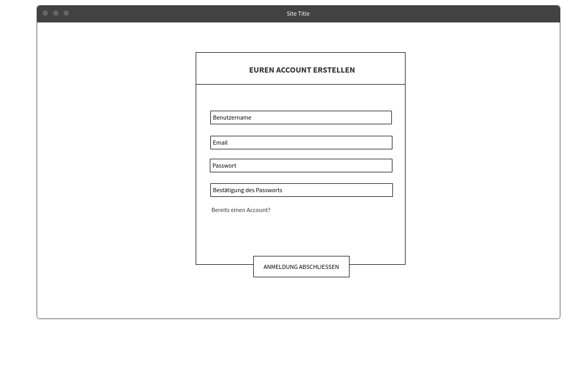

### Übersicht

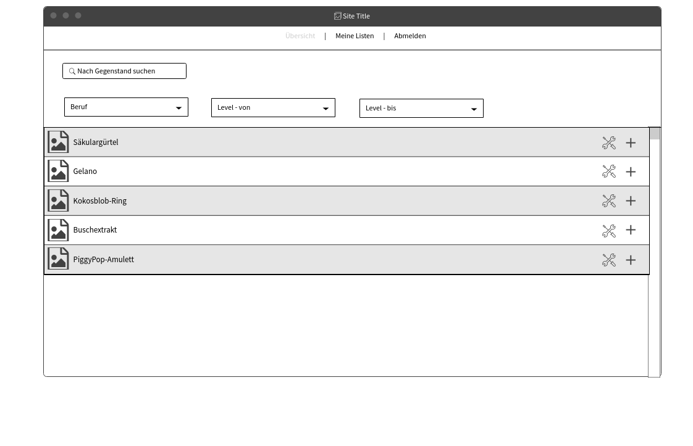

### Meine Listen

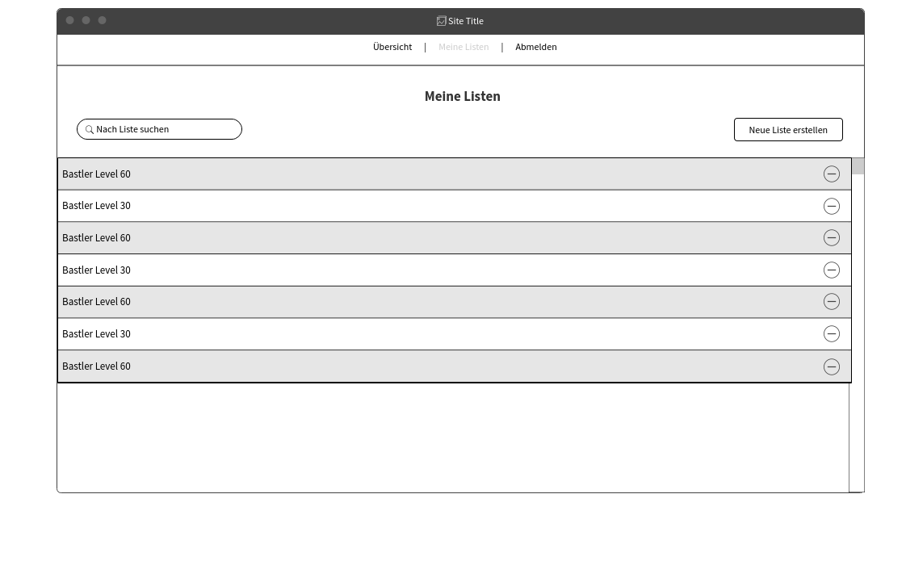

### Meine Liste - Reiter Gegenstand

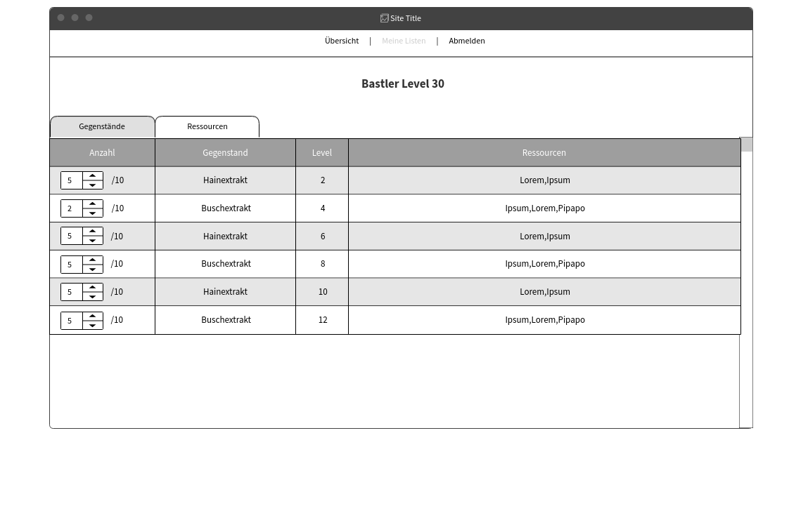

### Meine Listen - Reiter Ressourcen

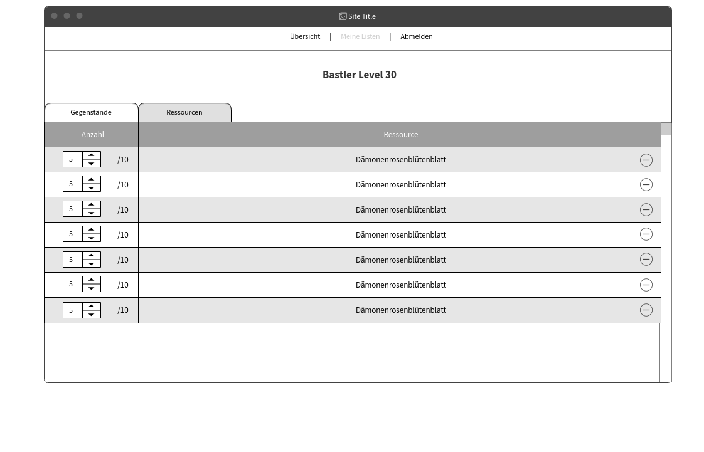


## Abstract Server
Verantwortlicher: Julian Schulzeck

Die Hauptaufgabe des Servers wird es sein, die Datenbank, die wir mit SQLite 3 umsetzen wollen, zu verwalten und über eine API die Daten an den Client zu liefern.
Um die enorm große Datenmenge (aktuell rund 5000 herstellbare Gegenstände und 2710 unterschiedliche Ressourcen) nicht per Hand in die Datenbank eintragen zu müssen, werde ich ein
"Hilfsprogramm" mit Java (und der Bibliothek Selenium) schreiben, welche die Datenbank erstellt, indem es die Daten von der Website crawled. Wir haben uns gegen ein "Echtzeit crawlen"
der Daten entschieden, da uns keine öffentliche API für die Dofus Website zur Verfügung steht und zu viele Anfragen an den Dofus Server einen temporären "Bann" mit sich zieht.


## UML

Hier ein UML Diagramm von den Objekten, die wir benötigen werden.
Ein **User** Objekt hat eine Liste von beliebig vielen **ItemListe** Objekten. Eine **ItemListe** enthält beliebig viele **Item** Objekte. Ein **Item** Objekt besitzt keine (wenn das Item nicht
herstellbar ist) bis eine **Rezeptur**. Ein **Item** besitzt außerdem die Attribute name, id, level, beruf, icon und anzahlBenoetigt. "level" bildet das Level des Items ab, "beruf" speichert
den Beruf mit dem man den Gegenstand herstellen kann und "icon" speichert das .png zu dem jeweiligen Item. Eine **Rezeptur** besteht aus eins bis acht **RezepturItem** Objekten.
**RezepturItem** erbt alle Attribute von **Item** und hat zusätzlich noch "anzahlBenoetigt" als Attribut, welches beschreibt, wie oft das Item für die Rezeptur benötigt wird.

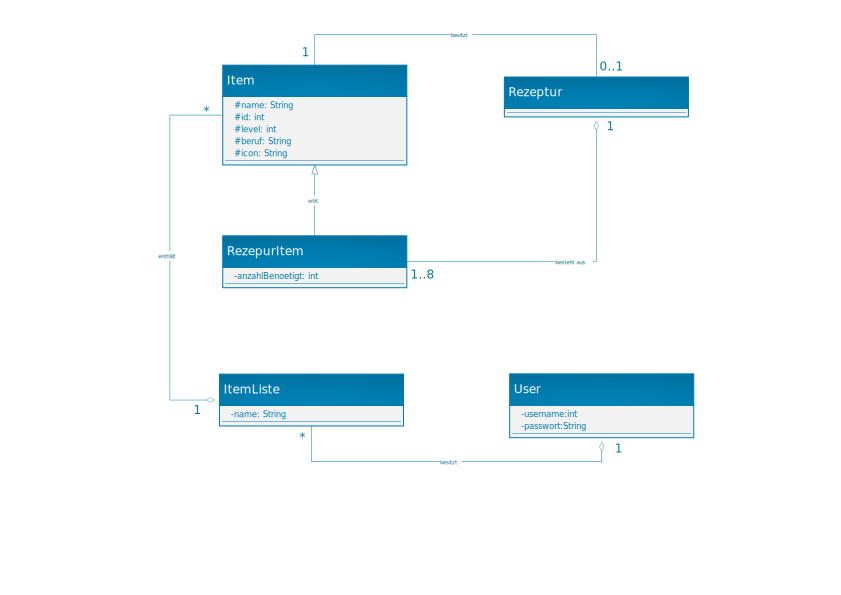

## ER-Diagramm

Auf der Datenbank werden die Daten folgendermaßen dargestellt:

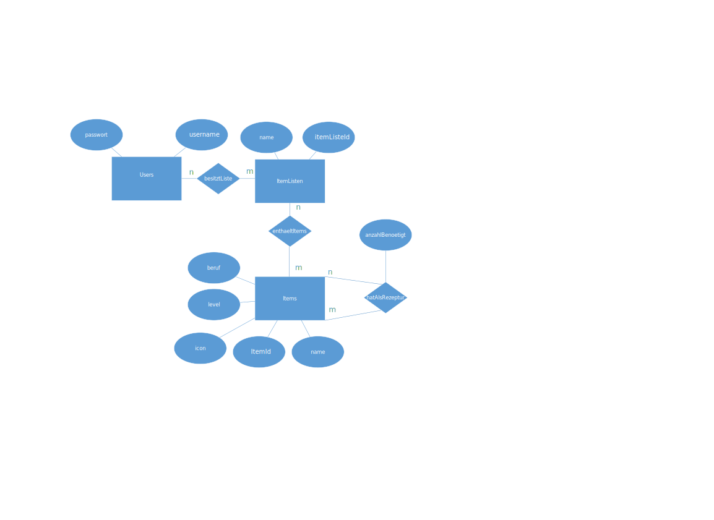

## Relationales Datenbankschema

Aus dem ER-Diagramm ergibt sich der folgende Relationale Entwurf:
Edit: es wurden ItemTypen und Berufe eingefügt um zu speichern welche unterschiedlichen ItemTypen bzw. Berufe es gibt
(Die Fettgedruckten Attribute stellen die Primärschlüssel dar)

### Entity-Typen

Users: **userId: int**, username: String, passwort: String

ItemListen: **itemListeId: int**, name: String

Items: **itemId: int**, name: String, level: int, icon: String

ItemTypen: **typId: int**, name: String

Berufe: **berufeId: int**, name: String

### Relationship-Typen

besitztListe: **userId: int**, **itemListeId: int**

enthaeltItems: **itemListeId: int**, **itemId: int**, anzahl:int

hatAlsRezeptur: **itemId: int**, **rezepturItemId: int**, anzahlBenoetigt: int

berufStelltHer: **itemId: int**, **berufeId**

istItemTyp: **itemId: int**, **typId**


## API-Beschreibung
Die API bietet insgesamt neun GET Befehle, drei POST Befehle und drei DELETE Befehle. Die entsprechenden Objekte sind unter dem Abschnitt "Template Object" zu finden.

### `GET /user`
Auf dieser Route liefert der Server alle User Objekte, die in der Datenbank gespeichert sind.

### `GET /user/:userId`
Auf dieser Route nimmt der Server eine userId entgegen.
Als Antwort liefert er das User Objekt mit der entsprechenden userId.

### `GET /user/:userId/itemlisten`
Auf dieser Route nimmt der Server eine userId entgegen.
Als Antwort liefert er alle ItemListe Objekte, die der entsprechende User gespeichert hat.

### `GET /items`
Auf dieser Route liefert der Server alle Item Objekte die herstellbar sind`

### `GET /berufe`
Auf dieser Route liefert der Server alle Berufe Objekte, die in der Datenbank gespeichert sind`

### `GET /itemtypen`
Auf dieser Route liefert der Server alle itemTypen Objekte, die in der Datenbank gespeichert sind`

### `Get /items/:itemId`
Auf dieser Route nimmt der Server eine itemId entgegen.
Als Antwort liefert er das Item Objekt mit der entsprechenden itemId`

### `Get /items/:berufId`
Auf dieser Route nimmt der Server eine berufId entgegen.
Als Antwort liefert er alle ItemObjekte, die durch diesen Beruf hergestellt werden`

### `Get /items/:typId`
Auf dieser Route nimmt der Server eine typId entgegen.
Als Antwort liefert er alle ItemObjekte, die diesen Itemtyp haben.`

### `POST /user`
Auf dieser Route nimmt der Server ein User Objekt entgegen und trägt es in die Datenbank ein falls es den User noch nicht gibt.
Als Antwort liefert er ein taskSucceeded Objekt wobei content ein User Objekt ist.
Wenn der username des übergebenen Users bereits in der Datenbank existiert, ist success = false ansonsten true.

### `POST /user/:userId/itemlisten`
Auf dieser Route nimmt der Server eine userId und ein ItemListe Objekt entgegen und trägt es in die Datenbank ein falls der User existiert.
Als Antwort liefert er ein taskSucceeded Objekt wobei content ein ItemListe Ojekt ist.
Wenn die userId des übergebenen Users nicht existiert, ist success = false ansonsten true.

### `POST /user/:userId/itemlisten/:itemListeId`
Auf dieser Route nimmt der Server eine userId, itemlisteId und ein enthaeltItem Objekt entgegen und trägt das Item in die
entsprechende ItemListe in die Datenbank ein falls der User, die itemliste und das Item existiert.
Als Antwort liefert er ein taskSucceeded Objekt.
Wenn die userId oder itemId nicht existiert, ist success = false ansonsten true.

### `DELETE /user/:userId`
Auf dieser Route nimmt der Server eine userId entgegen.
Falls der User existiert wird der Entsprechende User mit samt seinen Daten (ItemListen) aus der Datenbank gelöscht.
Als Antwort liefert der Server ein taskSucceeded Objekt.
Wenn die userId des übergebenen Users nicht existiert, ist success = false ansonsten true.

### `DELETE /user/:userId/itemlisten/:itemListeId`
Auf dieser Route nimmt der Server eine userId und eine itemListeId entgegen.
Falls der username und die itemListe existiert wird die itemListe aus der Datenbank gelöscht.
Als Antwort liefert der Server ein taskSucceeded Objekt.
Wenn der User oder die ItemListe des übergebenen Users nicht existiert, ist success = false ansonsten true.


### `DELETE /user/:userId/itemlisten/:itemListeId/item/:itemId`
Auf dieser Route nimmt der Server eine userId, itemListeId und itemId entgegen.
Falls der User, die Itemliste und das Item in der Itemliste existiert wird das Item aus der entsprechenden Itemliste gelöscht.
Als Antwort liefert der Server ein taskSucceeded Objekt.
Wenn der der User, die Itemliste und das Item in der Itemliste des übergebenen Users nicht existiert, ist success = false ansonsten true.

### Template Object

#### Template Object User
Enthält id, username und Passwort

```javascript
{
  userId: 0,
  username: "katzenlover",
  passwort: "felixFelicis"
}
```

#### Template Objekt ItemListe
Enthält name der ItemListe und alle itemIds von Items die in der Liste gespeichert wurden

```javascript
{
  itemListeId: 0,
  name: "SchneiderLeveln",
  items: [{itemId:6, anzahl: 2},{itemId:4, anzahl: 5},{itemId:42, anzahl: 1}]
}
```

#### Template Objekt Item
Enthält itemId, name, level, beruf der den Gegenstand herstellt, den namen des Icon.png und die RezepturItems.
Die RezepturItems sind folgendermaßen aufgebaut: {itemId, anzahlBenoetigt}.
Also benötigt man für die Herstellung unseres Template Objekt 5 x das Item mit id = 2, 10 x das Item mit id = 4 und 1x das Item mit id = 42.

```javascript
{
  itemId: 1,
  name: "Gelano",
  level: 60,
  beruf: "Juwelier",
  itemTyp: "Ring",
  icon: "gelanoIcon.png",
  rezepturItems:[{rezepturItemId:2,anzahlBenoetigt:5},{rezepturItemId:4,anzahlBenoetigt:10},{rezepturItemId:42,anzahlBenoetigt:1}]
}
```

#### Template Objekt Beruf
Enthält berufId und name.

```javascript
{
  berufId: 1,
  name: "Juwelier"
}
```

#### Template Objekt ItemTyp
Enthält typId und name.

```javascript
{
  typId: 1,
  name: "Ring"
}
```

#### Template Objekt enthaeltItem
Enthält itemId und anzahl. Anzahl gibt an, wie oft das Item hergestellt werden soll

```javascript
{
  itemId: 1,
  anzahl: 3
}
```

#### Template Objekt taskSucceeded
Dieses Objekt wird bei den POST und DELETE befehlen zurückgegeben. Dabei gibt "success" an, ob die Aufgabe des entsprechenden Befehls erfolgreich ausgeführt werden konnte und der content gibt das Objekt, welches gepostet wurde an. Das ist z.b. wichtig bei der erstellung eines Benutzers um direkt die id des users zurück zu liefern. Success und message sind immer definiert aber content kann auch undefined sein.

```javascript
{
  success: true,
  message: "User mit Id = 0 wurde hinzugefügt!"
  content: new_user
}
```

## Aufwandsschätzungen

### Frontend

Verantwortlicher: Jennifer Nguyen

#### Projektvorbereitung 


| Aufgabe                                       | Zeit in Std |
|-----------------------------------------------|------------:|
| Projektthema überlegen + grobe Funktionen     |  8          |
| Wireframe Mobil Registierung + Login          |  1          |
| Wireframe Mobil Übersicht + Filter            |  1          |
| Wireframe Mobil Meine Liste - Übersicht       |  1          |
| Wireframe Mobil Meine Liste - Gegenstände     |  1          |
| Wireframe Mobil Meine Liste - Ressourcen      |  1          |
| Wireframe Web Registrierung + Login           |  1          |
| Wireframe Web Übersicht                       |  1          |
| Wireframe Web Meine Liste - Übersicht	        |  1          |
| Wireframe Web Meine Liste - Gegenstände       |  1          |
| Wireframe Web Meine Liste - Ressourcen        |  1          |
| Aufwandseinschätzung	                        |  2          |
| **Summe**                                     |  **20**     |


#### Implementierung

| Aufgabe                                       | Zeit in Std |
|-----------------------------------------------|------------:|
| HTML Grundgerüst Registrierung + Login        |  2          |
| HTML Grundgerüst Übersicht                    |  2          |
| HTML Grundgerüst Meine Liste - Übersicht      |  2          |
| HTML Grundgerüst Meine Liste - Gegenstände    |  2          |
| HTML Grundgerüst Meine Liste - Ressourcen     |  2          |
| CSS-Styling Breakpoint small                  |  5          |
| CSS-Styling Breakpoint medium                 |  5          |
| CSS-Styling Breakpoint large                  |  5          |
| Implementierung Login + Registrierung	        |  6          |
| Implementierung Übersichtsseite + Filter      |  8          |
| Implementierung Übersicht über alle Listen    |  6          |
| Implementierung Gegenstände einer Liste	    |  8          |
| Implementierung Ressourcen in einer Liste     |  7          |
| **Summe**                                     |  **60**     |

#### Dokumentation / Tests

| Aufgabe                                       | Zeit in Std |
|-----------------------------------------------|------------:|
| Dokumentation Login + Registrierung           |  2          |
| Dokumentation Übersichtseite                  |  3          |
| Dokumentation Filter                          |  2          |
| Dokumentation Übersicht über alle Listen	    |  2          |
| Dokumentation über Gegenstände einer Liste    |  3          |
| Dokumentation über Ressourcen in einer Liste  |  2          |
| Dokumentation Mobil                           |  3          |
| Test der Benutzeroberfläche                   |  2          |
| Vergleich SOLL / IST Stunden                  |  1          |
| **Summe**                                     |  **20**     |

#### Zusammenfassung
| Teil                                          | Zeit in Std |
|-----------------------------------------------|------------:|
| Projektvorbereitung                           |  20         |
| Implementierung                               |  60         |
| Dokumentation / Tests                         |  20         |
| **Summe**                                     |  100        |

### Backend

Verantwortlicher: Julian Schulzeck

#### Projektvorbereitung

| Aufgabe                                       | Zeit in Std |
|-----------------------------------------------|------------:|
| Projektthema überlegen + grobe Funktionen     |  8          |
| Verfassen Abstract                            |  0.75       |
| Verfassen Abstract Client                     |  1          |
| Verfassen Abstract Server                     |  0.25       |
| Datenaufbau überlegen und planen              |  3          |
| UML Diagramm                                  |  2          |
| ER Diagramm                                   |  2          |
| Relationales Datenbankschema                  |  1          |
| Backend Endpunkte / API - Beschreibung        |  4          |
| Markdown                                      |  6          |
| Aufwandseinschätzung	                        |  2          |
| **Summe**                                     |  **30**     |

#### Implementierung und Validierung

| Aufgabe                                        | Zeit in Std |
|------------------------------------------------|------------:|
| Setup Framework                                |             |
| - Framework express                            |  0.25       |
| - Framework jest                               |  0.5        |
| - Framework sqlite3                            |  0.25       |
| Datenbank                                      |             |
| Datencrawler Implementieren                    |  8          |
| Setup                                          |  2          |
| Implementierung Auth                           |  3          |
| Implementierung GET /user                      |  2          |
| Implementierung GET /user/:username            |  2          |
| Implementierung GET /user/:username/itemlisten |  2          |
| Implementierung GET /items                     |  2.5        |
| Implementierung Get /items/:itemId             |  2.5        |
| Implementierung POST /user                     |  2.5        |
| Implementierung POST /user/:username/itemliste |  2.5        |
| Implementierung DELETE /user/:username         |  2          |
| Implementierung Validierungsschemata           |  3          |
| **Summe**                                      |  **35**     |

#### Dokumentation / Tests

| Aufgabe                                             | Zeit in Std |
|-----------------------------------------------------|------------:|
| Setup Tests                                         |  4          |
| Test DB                                             |  4          |
| Test GET /user                                      |  2          |
| Test GET /user/:username                            |  2          |
| Test GET /user/:username/itemlisten                 |  2          |
| Test GET /items                                     |  2          |
| Test Get /items/:itemId                             |  2          |
| Test POST /user                                     |  2          |
| Test POST /user/:username/itemliste                 |  2          |
| Test DELETE /user/:username                         |  2          |
| API-Dokumentation GET /user                         |  1          |
| API-Dokumentation GET /user/:username               |  1          |
| API-Dokumentation GET /user/:username/itemlisten    |  1          |
| API-Dokumentation GET /items                        |  1          |
| API-Dokumentation Get /items/:itemId                |  1          |
| API-Dokumentation POST /user                        |  1.5        |
| API-Dokumentation POST /user/:username/itemliste    |  1.5        |
| API-Dokumentation DELETE /user/:username            |  1          |
| Dokumentation                                       |  1          |
| Vergleich SOLL / IST Stunden                        |  1          |
| **Summe**                                           |  **35**     |


#### Zusammenfassung
| Teil                                     | Zeit in Std |
|------------------------------------------|------------:|
| Projektvorbereitung                      |  30         |
| Implementierung                          |  35         |
| Dokumentation / Tests                    |  35         |
| **Summe**                                |  100        |
